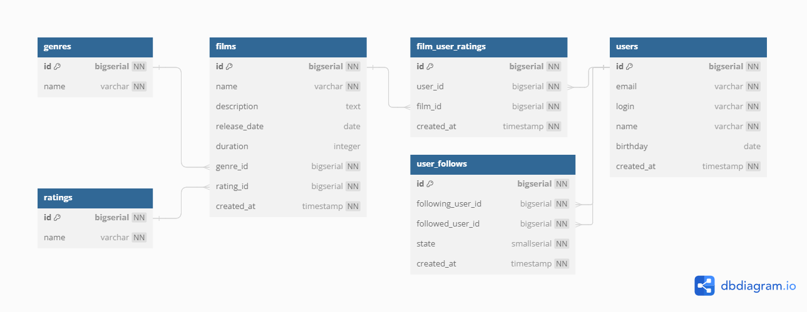

# Схема Базы Данных

Общий вид схемы приведен на изображении ниже

## Справочник: жанры фильмов [genres]

| Наименование поля | Тип       | NOT NULL | PK     | DEFAULT | Описание           |
|-------------------|-----------|----------|--------|---------|--------------------|
| id                | bigserial | true     | true   | AI      | ИД жанра           |
| name              | varchar   | true     | false  |         | Наименование жанра |

## Справочник: рейтинги фильмов [ratings]

| Наименование поля | Тип       | NOT NULL | PK     | DEFAULT | Описание              |
|-------------------|-----------|----------|--------|---------|-----------------------|
| id                | bigserial | true     | true   | AI      | ИД рейтинга           |
| name              | varchar   | true     | false  |         | Наименование рейтинга |

## Фильмы [films]

| Наименование поля | Тип       | NOT NULL | PK     | DEFAULT | Описание                           |
|-------------------|-----------|----------|--------|---------|------------------------------------|
| id                | bigserial | true     | true   | AI      | ИД фильма                          |
| name              | varchar   | true     | false  |         | Наименование фильма                |
| description       | text      | false    | false  |         | Описание                           |
| release_date      | date      | false    | false  |         | Дата выхода                        |
| duration          | integer   | false    | false  |         | Продолжительность, сек.            |
| genre_id          | bigserial | true     | false  |         | ИД жанра (справочник жанров)       |
| rating_id         | bigserial | true     | false  |         | ИД рейтинга (справочник рейтингов) |
| created_at        | timestamp | true     | false  | now()   | Дата и время внесения записи       |

### Получить список всех фильмов с наименованием жанра и рейтинга

``SELECT films.name,
       films.description,
       films.release_date,
       films.duration,
       genres.name,
       ratings.name
FROM films
JOIN genres ON genres.id = films.genre_id
JOIN ratings ON ratings.id = films.rating_id``

## Пользователи [users]

| Наименование поля | Тип       | NOT NULL  | PK     | DEFAULT | Описание                     |
|-------------------|-----------|-----------|--------|---------|------------------------------|
| id                | bigserial | true      | true   | AI      | ИД пользователя              |
| email             | varchar   | true      | false  |         | Адрес электронной почты      |
| login             | varchar   | true      | false  |         | Логин                        |
| name              | varchar   | true      | false  |         | Имя пользователя             |
| birthday          | date      | false     | false  |         | Дата рождения                |
| created_at        | timestamp | true      | false  | now()   | Дата и время внесения записи |

- Поле ``email`` является уникальным (unique)
- Поле ``login`` является уникальным (unique)

## Оценка фильмов пользователями [film_user_ratings]

| Наименование поля | Тип       | NOT NULL  | PK     | DEFAULT | Описание                     |
|-------------------|-----------|-----------|--------|---------|------------------------------|
| id                | bigserial | true      | true   | AI      | ИД связи                     |
| user_id           | bigserial | true      | false  |         | ИД пользователя              |
| film_id           | bigserial | true      | false  |         | ИД фильма                    |
| created_at        | timestamp | true      | false  | now()   | Дата и время внесения записи |

- Сочетание полей ``user_id``, ``film_id`` является уникальным (unique)

### Получить топ-10 фильмов, согласно голосам пользователей

``SELECT films.name,
films.description,
films.release_date,
films.duration,
COUNT(film_user_ratings.id)
FROM films
LEFT JOIN film_user_ratings ON film_user_ratings.film_id = films.id
GROUP BY films.id
ORDER BY COUNT(film_user_ratings.id) DESC
LIMIT 10``

## Подписки пользователей [user_follows]

| Наименование поля | Тип          | NOT NULL  | PK     | DEFAULT | Описание                     |
|-------------------|--------------|-----------|--------|---------|------------------------------|
| id                | bigserial    | true      | true   | AI      | ИД                           |
| following_user_id | bigserial    | true      | false  |         | ИД того, кто отправил запрос |
| followed_user_id  | bigserial    | true      | false  |         | ИД принимающего запрос       |
| state             | smallserial  | true      | false  | 0       | Состояния подписки           |
| created_at        | timestamp    | true      | false  | now()   | Дата и время внесения записи |

- Сочетание полей ``following_user_id``, ``followed_user_id`` является уникальным (unique)
- Состояние подписки: ``state`` может принимать два значения: запрос отправлен (0), запрос принят (1)

### Получить новые запросы на подписки для пользователя

``SELECT users.name
FROM users
JOIN user_follows ON user_follows.following_user_id = users.id
WHERE user_follows.followed_user_id = {ID}
AND state = 0``

- ``{ID}`` - ИД пользователя, для которого требуется получить список запросов на подписку

### Получить список друзей

``
SELECT users.name
FROM users
JOIN (
SELECT following.following_user_id AS user_id
FROM user_follows AS following
WHERE following.followed_user_id = {ID}
AND state = 1
UNION
SELECT followed.followed_user_id AS user_id
FROM user_follows AS followed
WHERE followed.following_user_id = {ID}
AND state = 1) AS friends
ON friends.user_id = users.id``

- ``{ID}`` - ИД пользователя, для которого требуется получить список друзей